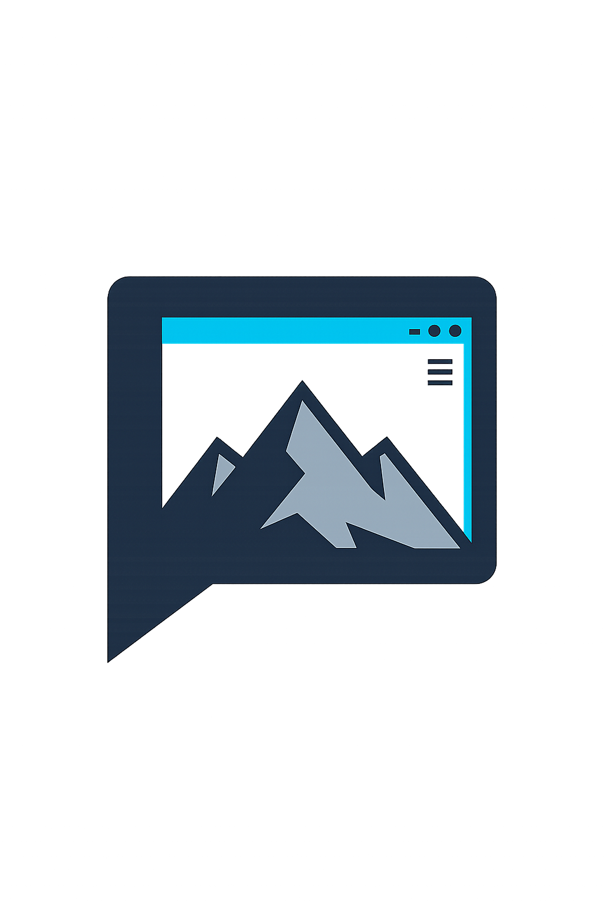

<p align="center">
  
</p>

# PeakUI

**PeakUI** is a local-first, self-hosted AI studio built around **WorkSpaces** — a persistent agent workspace for local Ollama models, OpenAI-compatible providers, RAG, tools, browser research, Canvas artifacts, automation, and session intelligence.

Built by **Muhammad Talha Raza** and owned by **[Peak Services INC](https://peakservices-inc.com)**.

[](LICENSE)

---

## Why PeakUI?

Most AI chat interfaces send your prompts, documents, and browsing history to someone else's cloud. PeakUI flips that model:

- **Local-first** — run models on your own hardware via Ollama.
- **Self-hosted** — your data stays on your infrastructure.
- **Agentic** — WorkSpaces gives task threads, tools, memory, and automation a persistent home.
- **Transparent** — open source, auditable, and under your control.

---

## At A Glance

| Area | What it does |
|---|---|
| **WorkSpaces** | Main agent shell for task threads, model selection, modes, tools, settings, and Knowledge Base |
| **Local models** | Ollama-first generation with health checks, model stop, exclusive switching, and context backoff |
| **Remote providers** | OpenAI-compatible endpoints, including Hugging Face router, TGI, vLLM, and SGLang-style servers |
| **Knowledge Base** | PostgreSQL-backed document index with semantic, keyword, hybrid RRF, source chips, and full-access mode |
| **Canvas** | Compact artifact rows, modal previews (PDF, image, markdown, code, table, chart, ZIP, ICS), source-editable binary artifacts, downloads, bundles, revisions, lineage, search, restore, exports, and a server-side preview endpoint for Excel/Word/email/slides/Mermaid inline rendering |
| **Tools** | Shell, filesystem, code sandbox, public browser, UWAF Direct/Stealth browser, PDF/Word/Excel/PowerPoint/CSV/Email/Markdown/ZIP/ICS/Mermaid artifact generation, and URL fetch-summarize with approval gates |
| **Automation** | Heartbeats, cron tasks, monitors, wake events, nudges, and guarded unattended local Ollama runs |
| **Session intelligence** | Rolling summaries, context health, auto-continue modes, branches, branch compare, and analytics |

---

## Quick Start

### 1. Start Ollama

```bash
ollama serve
```

Pull at least one chat model. Pull an embedding model only if you want semantic RAG.

```bash
ollama pull phi3:mini
ollama pull nomic-embed-text
```

### 2. Start PeakUI

```bash
# Linux / macOS (Docker Desktop)
docker compose up -d --build

# Windows (see WINDOWS-SETUP.md)
docker compose -f docker-compose.windows.yml up --build
```

Open [http://localhost:3000](http://localhost:3000).

On first visit, create the initial Admin account. After login, the app opens directly into WorkSpaces.

### 3. Configure The Studio

Open **Settings** inside WorkSpaces and set your provider, model, RAG, tool permissions, and session intelligence preferences.

---

## Documentation

| Document | Description |
|---|---|
| [INSTALL.md](INSTALL.md) | Detailed installation for Linux, macOS, and Windows |
| [WINDOWS-SETUP.md](WINDOWS-SETUP.md) | Windows Docker Desktop specific notes |
| [DEVELOPMENT.md](DEVELOPMENT.md) | Local development, tests, lint, and Prisma workflow |
| [docs/ARCHITECTURE.md](docs/ARCHITECTURE.md) | High-level system architecture |
| [docs/features.md](docs/features.md) | Full feature reference |
| [docs/settings-and-rag.md](docs/settings-and-rag.md) | Settings and Knowledge Base behavior |
| [docs/workspaces-host-executor.md](docs/workspaces-host-executor.md) | Optional host shell executor setup |
| [docs/capability-inventory.md](docs/capability-inventory.md) | Native tool capability inventory |
| [docs/pdf-document-workflow.md](docs/pdf-document-workflow.md) | PDF artifact workflow |
| [docs/word-document-workflow.md](docs/word-document-workflow.md) | Word document artifact workflow |
| [docs/workbook-document-workflow.md](docs/workbook-document-workflow.md) | Excel workbook artifact workflow |
| [docs/csv-document-workflow.md](docs/csv-document-workflow.md) | CSV export artifact workflow |
| [docs/email-document-workflow.md](docs/email-document-workflow.md) | Email draft artifact workflow |
| [docs/markdown-document-workflow.md](docs/markdown-document-workflow.md) | Markdown document artifact workflow |
| [docs/fetch-summarize-workflow.md](docs/fetch-summarize-workflow.md) | URL fetch and summarize workflow |
| [docs/tax-pdf-workflow.md](docs/tax-pdf-workflow.md) | Tax document review workflow |
| [docs/slides-document-workflow.md](docs/slides-document-workflow.md) | PowerPoint slide deck artifact workflow |
| [docs/archive-document-workflow.md](docs/archive-document-workflow.md) | ZIP archive bundle artifact workflow |
| [docs/calendar-document-workflow.md](docs/calendar-document-workflow.md) | ICS calendar event artifact workflow |
| [docs/mermaid-document-workflow.md](docs/mermaid-document-workflow.md) | Mermaid diagram artifact workflow |
| [docs/development-section-plan.md](docs/development-section-plan.md) | Development section plan (draft) |

---

## Important Paths

| Path | Purpose |
|---|---|
| `/mnt/openclaw/workspace` | Managed workspace path inside the app container |
| `/tmp/peakui-openclaw-workspace` | Host-style alias for the managed workspace |
| `src/app/components/OpenClawWorkspace.tsx` | Main WorkSpaces UI |
| `src/lib/chat-completion.ts` | Shared streaming completion pipeline |
| `src/lib/chat-sessions.ts` | Session persistence, branching, summaries, analytics |
| `src/lib/session-intelligence.ts` | Context management, analytics, continuation detection |
| `src/lib/openclaw-automation*.ts` | Automation worker and unattended execution |
| `src/lib/uwaf-*` | Unified browser, stealth/direct browsing, sanitization |
| `src/lib/rag.ts` | Knowledge Base retrieval and indexing logic |
| `prisma/schema.prisma` | PostgreSQL data model |

---

## API Map

| Route | Purpose |
|---|---|
| `/api/chat/completions` | Streaming chat and WorkSpaces generation |
| `/api/chat/completed` | Session finalization after generation |
| `/api/chats` | List, create, update, delete sessions |
| `/api/chats/[id]/branch` | Fork a session from a selected message |
| `/api/settings` | Per-user app and WorkSpaces settings |
| `/api/rag/*` | Knowledge Base upload, search, health, diagnostics |
| `/api/canvas/artifacts*` | Canvas artifact list, create, edit, delete, revisions, server-side preview, and downloads |
| `/api/openclaw/*` | WorkSpaces workspace, tools, browser, document generation (PDF, Word, Excel, PowerPoint, CSV, Email, Markdown, ZIP, ICS, Mermaid), fetch-summarize, and automation |

---

## Environment

See [`.env.example`](.env.example) for a full template.

| Variable | Required | Description |
|---|---:|---|
| `DATABASE_URL` | Yes | PostgreSQL connection string |
| `JWT_SECRET` | Yes | Strong secret for signing JWTs (min 32 chars) |
| `OPENCLAW_HOST_EXECUTOR_TOKEN` | Optional | Enables host-side shell executor integration |
| `OPENCLAW_HOST_WORKSPACE_DIR` | Optional | Host path mounted as the managed workspace |
| `TOR_PROXY_URL` | Optional | SOCKS proxy for UWAF stealth mode, defaulted by Compose |
| `BRAVE_API_KEY` | Optional | Brave search backend |
| `SEARXNG_URL` | Optional | Self-hosted SearXNG backend |
| `GOOGLE_SEARCH_API_KEY` | Optional | Google Programmable Search backend |
| `GOOGLE_SEARCH_CX` | Optional | Google Programmable Search CX id |

---

## Operations

```bash
# Build and start
docker compose up -d --build

# View logs
docker compose logs -f app

# Run tests
npm test

# Generate Prisma client
npx prisma generate

# Apply schema changes (development only)
npx prisma db push
```

Do **not** use destructive Prisma reset commands on a real database.

---

## Security Model

PeakUI is a powerful local tool: it can run shell commands, access files, browse the web, and invoke local models. By default these capabilities are gated by:

- JWT-based authentication and per-user permissions
- Personal tool-permission toggles
- Approval tokens for destructive or interactive actions
- Optional host executor with approved roots and env allowlists
- Tor-routed stealth browsing with failsafe preflight checks

Read [SECURITY.md](SECURITY.md) for responsible use, reporting vulnerabilities, and deployment hardening.

---

## Contributing

We welcome contributions. See [CONTRIBUTING.md](CONTRIBUTING.md) for guidelines, [CODE_OF_CONDUCT.md](CODE_OF_CONDUCT.md) for community standards, and [CHANGELOG.md](CHANGELOG.md) for release history.

---

## License

Copyright © 2026 Muhammad Talha Raza / Peak Services INC.

PeakUI is released under the [MIT License](LICENSE).

---

## Support

- Email: [info@peakservices-inc.com](mailto:info@peakservices-inc.com)
- Website: [https://peakservices-inc.com](https://peakservices-inc.com)
