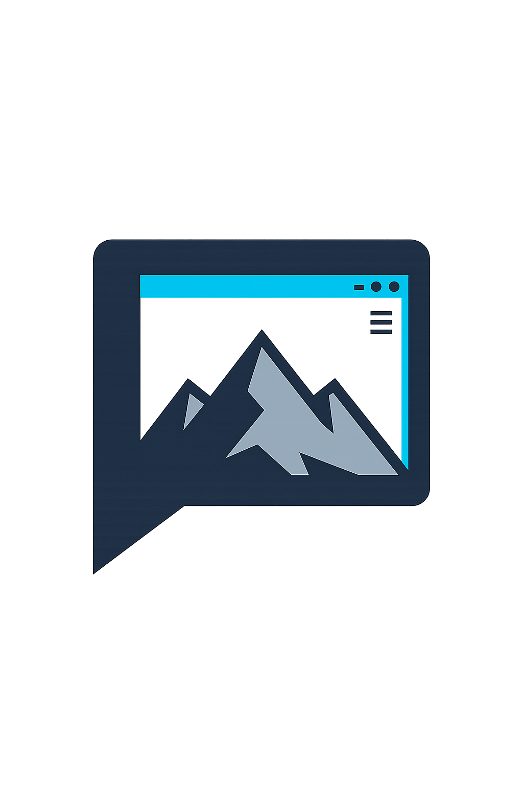
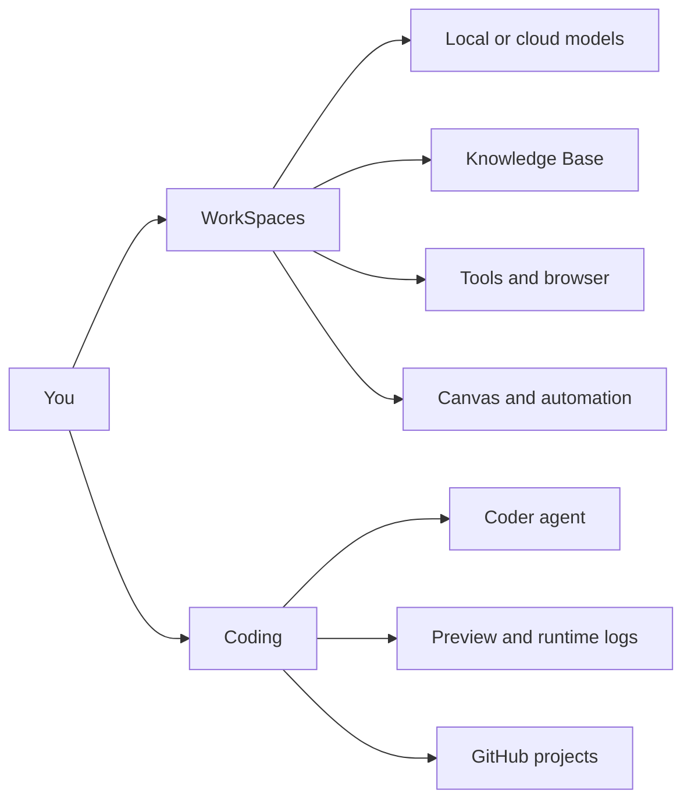
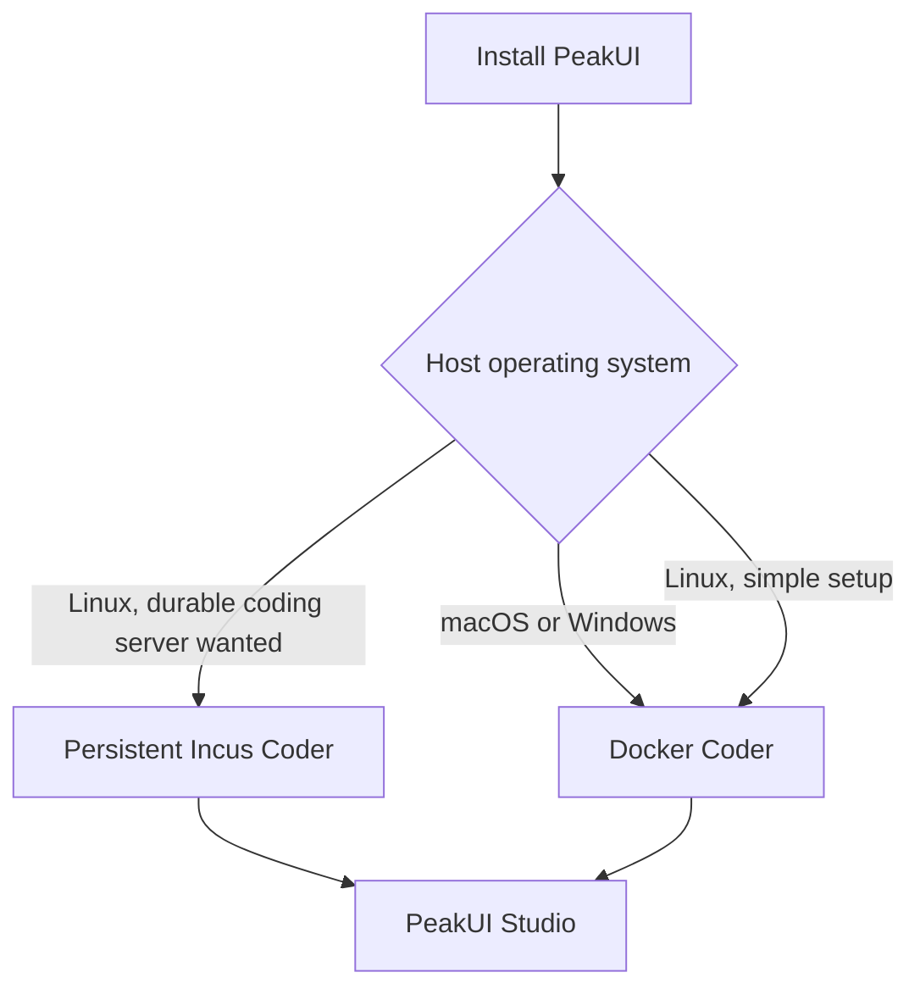
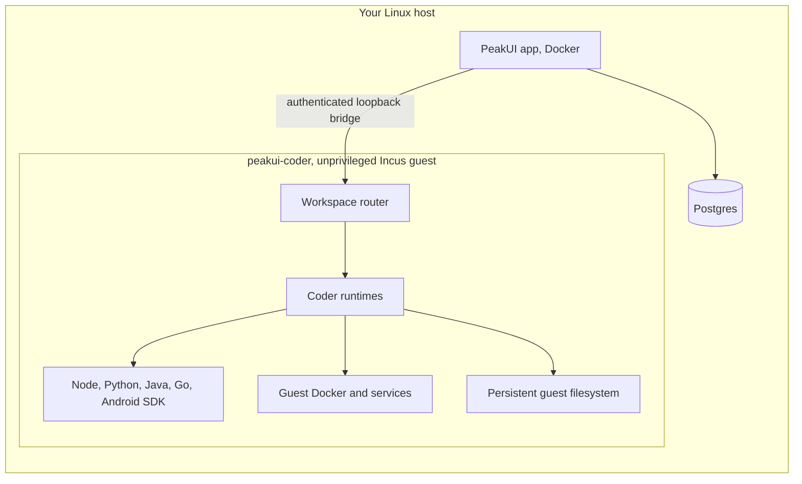
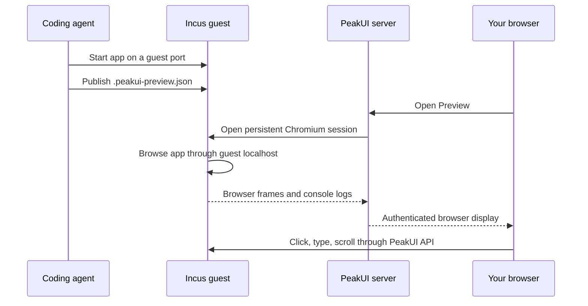
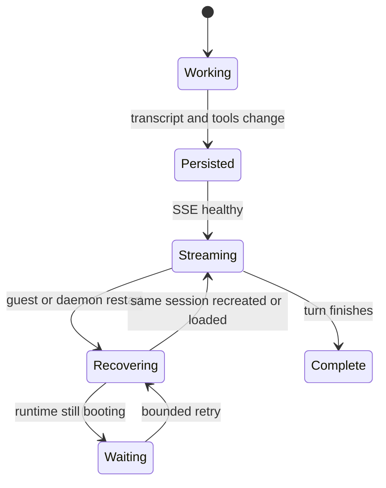
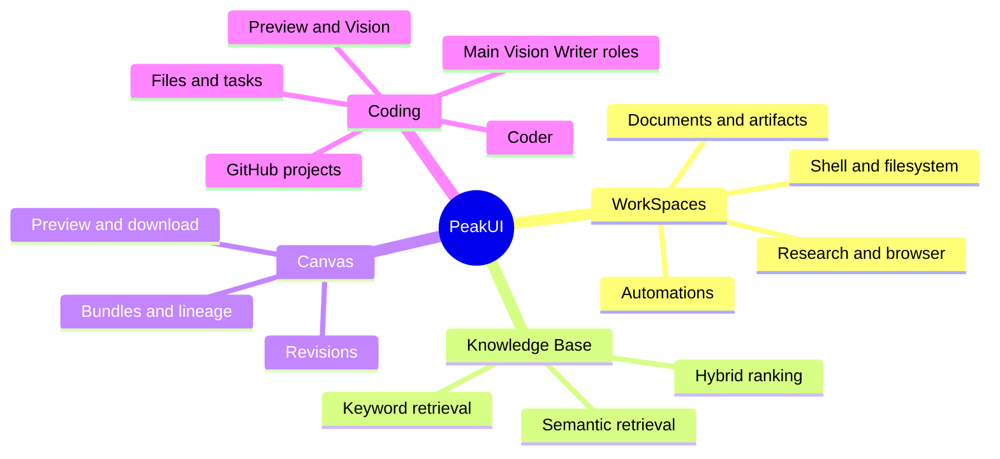
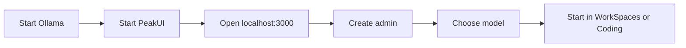

<p align="center">
  
</p>

<h1 align="center">PeakUI</h1>

<p align="center">
  A self-hosted AI studio for research, documents, automation, and durable coding agents.
</p>

<p align="center">
  <a href="LICENSE"></a>
  <a href="docs/coding-environment.md"></a>
  <a href="docs/operations-and-updates.md"></a>
</p>

Built by **Muhammad Talha Raza** and owned by [Peak Services INC](https://peakservices-inc.com).

## The Studio At A Glance


```mermaid
flowchart LR
  U[You] --> W[WorkSpaces]
  U --> C[Coding]
  W --> M[Local or cloud models]
  W --> K[Knowledge Base]
  W --> T[Tools and browser]
  W --> A[Canvas and automation]
  C --> Q[Coder agent]
  C --> P[Preview and runtime logs]
  C --> G[GitHub projects]
```

| Open | Use it for | What stays durable |
|---|---|---|
| **WorkSpaces** | Research, documents, browsing, tools, and automation | Chats, artifacts, Knowledge Base, automation, workspace files |
| **Coding** | Full projects, terminal work, agents, browser preview, GitHub | Sessions, project files, context handoffs, tool activity, previews |
| **Canvas** | Inspect, edit, version, bundle, and download artifacts | Revisions, lineage, source files, exports |
| **Settings** | Models, providers, permissions, themes, GitHub, context policy | Per-user configuration |

## Choose A Path


```mermaid
flowchart TD
  Start[Install PeakUI] --> Host{Host operating system}
  Host -->|Linux, durable coding server wanted| Incus[Persistent Incus Coder]
  Host -->|macOS or Windows| Docker[Docker Coder]
  Host -->|Linux, simple setup| Docker
  Incus --> Studio[PeakUI Studio]
  Docker --> Studio
```

### Docker Coder

The default on all supported platforms. It is a good fit for ordinary repositories and a quick self-hosted setup.

```bash
# Linux / macOS
curl -fsSL https://raw.githubusercontent.com/rajatalha150/PeakUI/trimmer/scripts/install.sh | sh

# Windows PowerShell
irm https://raw.githubusercontent.com/rajatalha150/PeakUI/trimmer/scripts/install.ps1 | iex
```

### Persistent Linux Coder

For long-running engineering work, native/Android builds, package installation, system services, nested Docker, and projects that must outlive app updates.

```bash
curl -fsSL https://raw.githubusercontent.com/rajatalha150/PeakUI/coder-lxd/scripts/install.sh \
  | PEAKUI_CODER_BACKEND=lxd sh
```

The installer can install and initialize Incus, ask for `sudo` only when host setup requires it, provision the guest, verify nested Docker with a real container run, migrate existing Coder state, and switch PeakUI to the guest only after its authenticated health check succeeds.

On Linux x86_64, a fresh Coder guest now includes JDK 17, Node/Corepack, Go, Python, CMake/Ninja/Clang, Git LFS and everyday file/network tools, plus a verified Android SDK baseline (API 35/36, build tools, platform tools, NDK 27.3, and CMake 3.22.1). The Docker Coder image gets the same baseline on Linux x86_64, including fresh Docker deployments on macOS and Windows hosts. The SDK is persisted and repaired on update; an Android emulator is not included because running one requires additional host virtualization/device access. See [Android toolchain setup and checks](docs/coder-lxd.md#android-build-toolchain).

## Why Persistent Coder Is Different


```mermaid
flowchart LR
  subgraph Host[Your Linux host]
    App[PeakUI app, Docker]
    DB[(Postgres)]
    subgraph Guest[peakui-coder, unprivileged Incus guest]
      Router[Workspace router]
      Coder[Coder runtimes]
      Toolchain[Node, Python, Java, Go, Android SDK]
      Docker[Guest Docker and services]
      Files[Persistent guest filesystem]
      Router --> Coder
      Coder --> Toolchain
      Coder --> Docker
      Coder --> Files
    end
    App -->|authenticated loopback bridge| Router
    App --> DB
  end
```

| | Docker Coder | Persistent Incus Coder |
|---|---|---|
| Runtime | Recreated application container | Persistent unprivileged Linux system container |
| Filesystem | Defined by image and mounted volumes | Any selected absolute path inside the guest root |
| Packages and services | Rebuild or explicitly persist them | `apt`, `systemd`, services, and toolchains persist naturally |
| Complex builds | Good for normal projects | Designed for Android, native, multi-service, and nested Docker work |
| Host access | Isolated from host root | Still isolated: no host root or Incus socket is exposed to the agent |

The guest behaves like a durable development server, not an unrestricted host shell. Its `/` is the guest filesystem, never the host filesystem.

## Preview That Works From Any Device


```mermaid
sequenceDiagram
  participant A as Coding agent
  participant G as Incus guest
  participant S as PeakUI server
  participant B as Your browser
  A->>G: Start app on a guest port
  A->>G: Publish .peakui-preview.json
  B->>S: Open Preview
  S->>G: Open persistent Chromium session
  G->>G: Browse app through guest localhost
  G-->>S: Browser frames and console logs
  S-->>B: Authenticated browser display
  B->>G: Click, type, scroll through PeakUI API
```

Preview runs Chromium inside the persistent Coder guest and displays its frames
through the authenticated PeakUI API. `localhost` belongs to the guest, so its
apps can use the same ports as host applications without conflicts. Sites keep
their real URLs, cookies, redirects, CSS and WebSockets. The popup no longer
requires public port `4173` or a separate preview hostname. Browser profiles
persist in the guest; Vision and console logs inspect the same live page you see.
See [Coder Browser](docs/coder-browser.md) for architecture and current limits.

The Preview window provides:

- Desktop, tablet, and mobile viewport frames.
- Resize, move, maximize, reload, and automatic running-port discovery.
- Guest-local and public HTTP(S) URLs, including sites that prohibit framing.
- `Vision` screenshot review for the selected viewport.
- `Log` diagnostics: timestamped console output, page errors, failed requests, and HTTP failures with one-click copy. Vision receives the captured log with the screenshot when available.

## Durable Agent Sessions


```mermaid
stateDiagram-v2
  [*] --> Working
  Working --> Persisted: transcript and tools change
  Persisted --> Streaming: SSE healthy
  Streaming --> Recovering: guest or daemon restart
  Recovering --> Streaming: same session recreated or loaded
  Recovering --> Waiting: runtime still booting
  Waiting --> Recovering: bounded retry
  Streaming --> Complete: turn finishes
```

Coding sessions use a durable PeakUI session ID, persistent transcript records, context handoffs, and a reconnecting SSE stream. If a guest restart removes the daemon's in-memory session, PeakUI automatically restores the same session and resumes its stream instead of requiring a new tab or a new chat.
Coder's own transcript and compaction govern live turns; PeakUI no longer pastes saved episode summaries into every user prompt. Its Postgres ledger remains available for explicit history lookup and handoff checkpoints.

## Core Capabilities


```mermaid
mindmap
  root((PeakUI))
    WorkSpaces
      Research and browser
      Shell and filesystem
      Documents and artifacts
      Automations
    Knowledge Base
      Semantic retrieval
      Keyword retrieval
      Hybrid ranking
    Canvas
      Revisions
      Preview and download
      Bundles and lineage
    Coding
      Coder
      Files and tasks
      GitHub projects
      Preview and Vision
      Main Vision Writer roles
```

- **Local-first models:** Ollama, plus OpenAI-compatible remote providers.
- **Knowledge Base:** PostgreSQL-backed semantic, keyword, and hybrid retrieval.
- **Artifacts:** PDF, Office, slides, spreadsheets, CSV, email, Markdown, Mermaid, ZIP, ICS, and image workflows.
- **Tools:** gated shell/filesystem operations, public and stealth browser modes, document generation, and fetch/summarize.
- **Automation:** schedules, heartbeats, monitors, wake events, and guarded unattended local runs.
- **GitHub:** connect in Coding settings, import repositories, retain the project in the persistent workspace, and use the normal agent/terminal workflow.
- **Coding model roles:** choose Main from the header or configure Main, Vision, and Writer in Coding settings. The theme-matched menus show complete model names on desktop and phone, support keyboard selection, and identify incompatible models without hiding them.

## First Run


```mermaid
flowchart LR
  A[Start Ollama] --> B[Start PeakUI]
  B --> C[Open localhost:3000]
  C --> D[Create admin]
  D --> E[Choose model]
  E --> F[Start in WorkSpaces or Coding]
```

1. Start Ollama and pull at least one model:

   ```bash
   ollama serve
   ollama pull phi3:mini
   ollama pull nomic-embed-text # optional, for semantic RAG
   ```

2. Open [http://localhost:3000](http://localhost:3000), create the first Admin account, and choose a model in Settings.

3. Use **WorkSpaces** for general work or **Coding** for repository work. On Linux persistent Coder, select any valid absolute directory in the guest such as `/workspace/project` or `/apps/project`.

## Operations

```bash
# Standard Docker backend
docker compose up -d --build
docker compose logs -f app

# Persistent Linux Coder update
PEAKUI_CODER_BACKEND=lxd ./scripts/install.sh

# Tests
npm test
npm run bundle:check
```

Use the installer for updates, especially when persistent Coder is enabled. It preserves the selected backend and supplies the necessary LXD Compose overlay. Do not run a base-only Compose recreation of `app` on an LXD deployment; it omits the guest daemon bridge configuration.

Back up a persistent Coder guest and Postgres together:

```bash
./scripts/coder-lxd/backup.sh /path/to/backup-directory
```

## Documentation

| Need | Read |
|---|---|
| Architecture overview | [docs/architecture.md](docs/architecture.md) |
| Coding UI, sessions, context, preview, model roles | [docs/coding-environment.md](docs/coding-environment.md) |
| Persistent Incus/LXD Coder, backups, recovery, host prerequisites | [docs/coder-lxd.md](docs/coder-lxd.md) |
| Keep hosts, dependencies, and the repo current | [docs/operations-and-updates.md](docs/operations-and-updates.md) |
| GitHub import and integration | [docs/github-coder-integration.md](docs/github-coder-integration.md) |
| Installation details | [INSTALL.md](INSTALL.md), [WINDOWS-SETUP.md](WINDOWS-SETUP.md), [DEPLOYMENT.md](DEPLOYMENT.md) |
| Security model | [SECURITY.md](SECURITY.md) |
| Full feature and tool reference | [docs/features.md](docs/features.md), [docs/tool-workflows.md](docs/tool-workflows.md), [docs/tool-call-formats.md](docs/tool-call-formats.md) |
| Image generation | [docs/image-generation.md](docs/image-generation.md) |
| Troubleshooting | [TROUBLESHOOTING.md](TROUBLESHOOTING.md) |

## Security

PeakUI can use files, shell commands, browsers, models, and external providers. It protects those capabilities with authentication, per-user permissions, tool approvals, session ownership checks, validated workspace paths, and an authenticated daemon gateway. Persistent Coder expands the guest's capabilities without granting it host root access.

Read [SECURITY.md](SECURITY.md) before exposing PeakUI beyond a trusted network.

## License And Support

PeakUI is released under the [MIT License](LICENSE). For support, contact [info@peakservices-inc.com](mailto:info@peakservices-inc.com) or visit [peakservices-inc.com](https://peakservices-inc.com).
