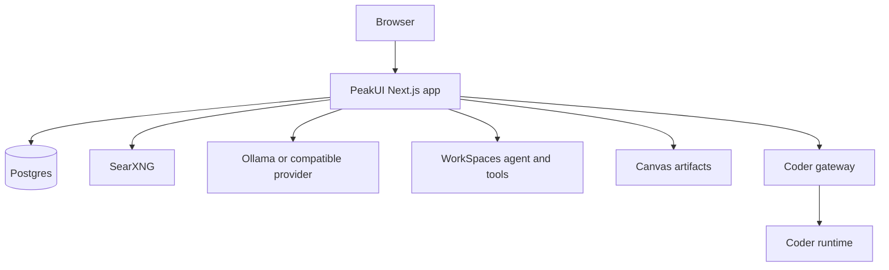
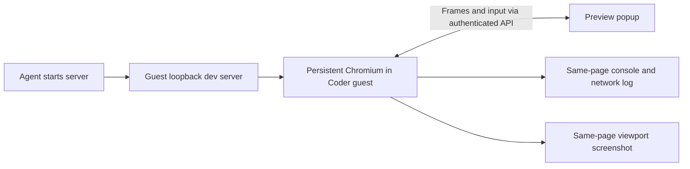

# PeakUI Architecture

This page is the current visual map of PeakUI. Detailed contracts live in the linked subsystem documents.

## System Map



## Coder Runtimes

```mermaid
flowchart LR
  UI[Coding UI] --> Gateway[Authenticated /api/coder gateway]
  Gateway --> Choice{Backend}
  Choice -->|Docker default| Docker[Coder Docker container]
  Choice -->|Linux persistent| Bridge[Loopback bridge :4171]
  Bridge --> Guest[Incus guest: peakui-coder]
  Guest --> Router[Workspace router]
  Router --> Root[/workspace runtime]
  Router --> Project[Per-project runtime]
```

The browser never receives the Coder daemon token. Gateway authorization binds each daemon session to its PeakUI owner and its selected workspace.

## Preview Flow



Chromium resolves `localhost` inside the Coder guest, independently of host
ports. PeakUI authorizes each browser action against the coding session owner;
the browser control endpoint is private to the guest router. Vision and Log
inspect the displayed page. The agent's `.peakui-preview.json` still publishes
URLs and refreshes the page after edits. See [Coder Browser](coder-browser.md).

## Persistence Boundaries

| State | Durable location | Recovery behavior |
|---|---|---|
| Users, settings, chats, context ledger, Canvas metadata | Postgres | Survives app/container restart |
| Coder project filesystem, package installs, services, caches, SSH, Coder data | Incus guest root on persistent Coder | Survives guest/app restart and PeakUI updates |
| Live SSE subscription | Browser connection | Reconnects with cursor/epoch resume; 404 from a recreated guest session triggers same-session restoration |
| Preview server | Guest process/service | Auto-discovered when listening; agent can publish `.peakui-preview.json` for an exact URL/device |

## Related Docs

- [Coding environment](coding-environment.md)
- [Persistent Incus/LXD Coder](coder-lxd.md)
- [Operations and updates](operations-and-updates.md)
- [GitHub Coder integration](github-coder-integration.md)
