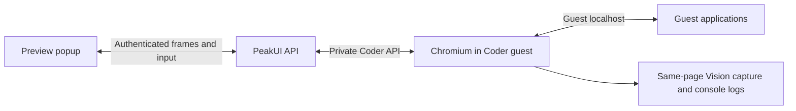

# Coder Browser

Coder Preview runs Chromium inside the isolated Coder Linux runtime (persistent
Incus/LXD guest or Docker Coder container). The popup
receives JPEG frames over PeakUI's authenticated API and sends pointer, keyboard,
paste, scroll, navigation and viewport commands back to the same page.
On phones, a tap focuses the local keyboard during the gesture, then releases
it if Chromium reports the target is not editable. Backspace, Delete, arrow
keys and IME text are forwarded as distinct browser actions rather than
collapsing everything into inserted characters.



Local URLs refer to the guest, not the host or the viewer's machine. A guest app
on port 80 or 3000 can coexist with a host app on the same port. No app-port
publication, iframe embedding, cookie rewriting or application proxy is required.
HTTP and HTTPS public and private destinations are reachable according to the
guest's own network configuration. TLS certificates are validated by Chromium.

Browser profiles are stored in `/var/lib/peakui/browser` in the persistent guest
root, keyed by a hash of the authenticated user and coding session. Cookies and
local storage survive browser restarts. Docker Coder mounts the same directory
as the `coder_browser_state` named volume so image updates keep these profiles;
the LXD migration copies that volume when switching backends. Active pages
survive popup closure until
20 minutes of inactivity. Up to eight browsers can be active; idle ones close
automatically. Closing Chromium does not delete the profile.

The API verifies ownership of the coding session before forwarding any browser
command. The guest endpoint requires the existing Coder bearer token. No Chrome
debugging port or browser profile is exposed to the user's browser.

Vision and Log use the current page, including its current login state and scroll
position. Desktop, tablet and mobile resize that page without navigating away.
The legacy proxy endpoints remain for compatibility but no longer render the
Coder popup. The same workspace router and guest-local browser action path run
on both Coder backends.

## Deployment and Verification

The LXD installer copies `scripts/coder-browser` into `/opt/qwen-code/browser`
and installs Chromium and Puppeteer there; the Docker Coder image includes the
same files and runtime. The workspace router loads the browser module on
demand. Existing installations need the updated router, browser module and
PeakUI frontend deployed together.

Run the guest integration test with:

```sh
cd /opt/qwen-code/browser
PUPPETEER_CACHE_DIR=/opt/puppeteer-cache CODER_BROWSER_INTEGRATION=1 node --test session.node-test.mjs
```

The test checks guest-local navigation, redirects, a page that forbids iframe
embedding, input, console collection, screenshot generation and viewport changes.
Frames are currently requested approximately four times per second, subject to
network and rendering speed; this is an interactive development preview, not a
video-streaming desktop. Browser-native file dialogs and downloads are not yet
integrated into the popup; use Coder Files for guest files.
